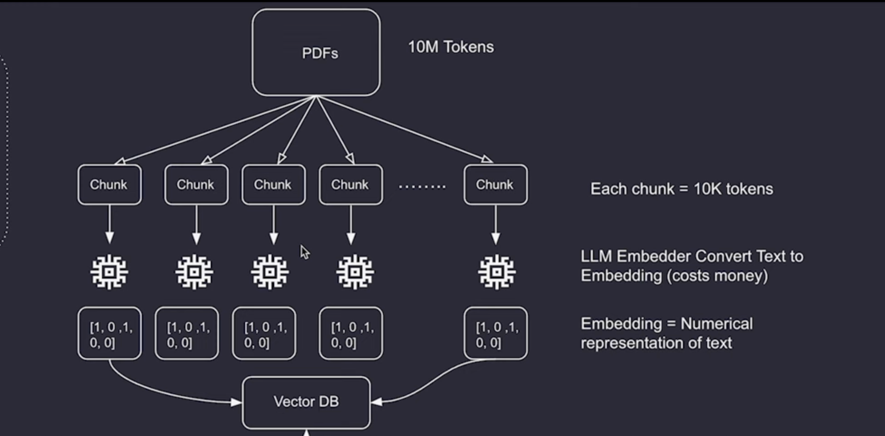
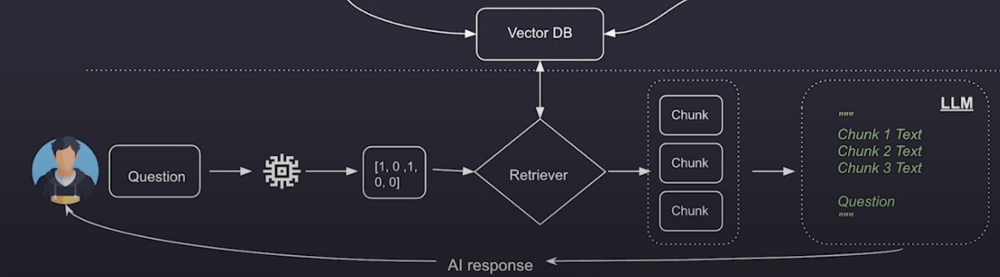
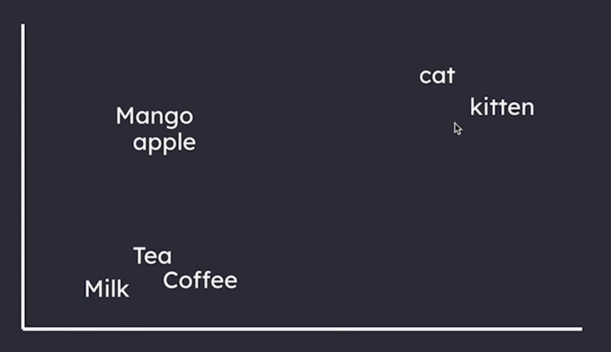
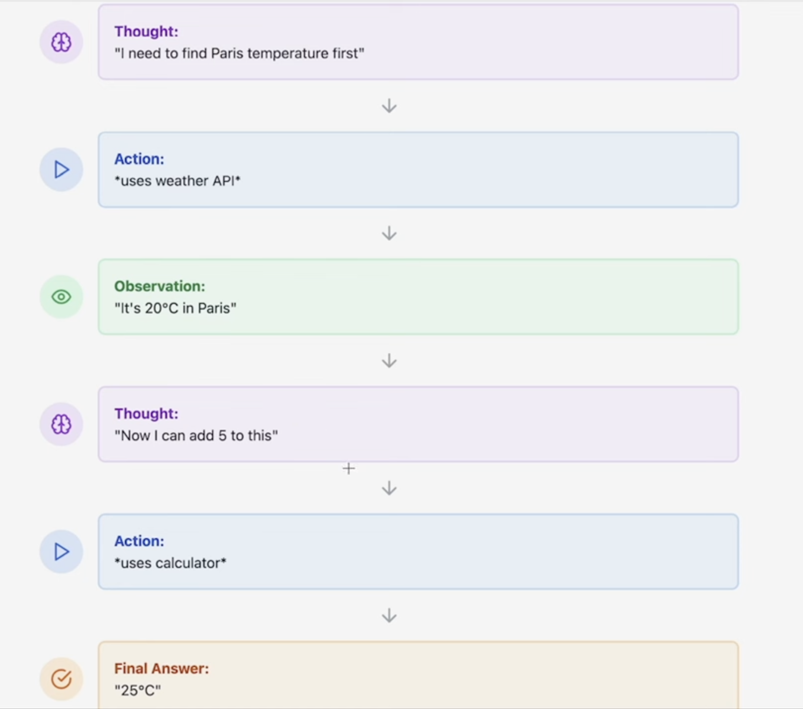

# **LangChain**

## **Core Components**

1. **Chat Models**
2. **Prompt Templates**
3. **Chains**
4. **Retrieval Augmented Generation (RAGs)**
5. **Agents and Tools**
6. **Memory** (Allows persistence of past interactions for better context)

## **Setting Up LangChain**
Before using LangChain, create a virtual environment:

```bash
python3 -m venv .venv
source .venv/bin/activate
```

Then install the required package:

```bash
pip3 install -qU langchain-openai
```

## **Chat Models**
Chat models allow structured communication with LLMs like GPT-4, Hugging Face models, and Claude Sonnet.

### **Why Use LangChain Chat Models?**
1. **Consistent Workflow**
2. **Easy Switching Between LLMs**
3. **Context Management**
4. **Efficient Chaining**
5. **Scalability**

### **Types of Messages in LangChain**
1. **System Message** – Defines the AI's role and sets context. Example: *"You are a marketing agent."*
2. **Human Message** – Represents user input or questions directed towards AI.
3. **AI Message** – Contains the AI response based on previous messages.

(For cloud storage, messages can be stored in Firebase or other databases instead of locally.)

---

## **Prompt Templates**
A **PromptTemplate** in LangChain is a structured way to format prompts dynamically. It allows placeholders that can be filled at runtime, ensuring reusable and consistent prompts.

### **Limitation & Workaround**
By default, prompt templates take values as a list containing a single HumanMessage. To allow more control, such as customizing SystemMessage too, a list of tuples can be used instead. (This approach ensures better flexibility.)

---

## **Chains**
Chains are sequences of modular components (LLMs, prompt templates, memory, tools) that process and generate responses efficiently.

### **Types of Chains**
1. **ParallelChain** – Tasks run independently.
2. **SequentialChain** – Steps execute in sequence.
3. **RouterChain / ConditionalChaining** – Routes inputs to different sub-chains based on conditions.
4. **AgentChain** – Uses AI agents to decide which tools/actions to use.

---

## **Retrieval Augmented Generation (RAGs)**
### **Why Use RAGs?**
RAGs allow LLMs to access external knowledge sources, solving the limitation of context window size by retrieving only relevant information instead of overwhelming the model.

### **How RAGs Work**
1. **Chunking** – Splits large documents into smaller chunks.
2. **Retrieval** – Queries only the relevant chunks.
3. **Embeddings & Vector Databases** – Converts text into vector embeddings, storing them efficiently for retrieval.




### **Embeddings & Vector DBs**
- **Vector embeddings** represent words, sentences, or images as mathematical vectors.
- **Vector databases** store embeddings and allow similarity searches.
- Example: *A cat’s vector might look like [34, 21, 7.5, -12, 0.2, 18, -3]*
- Similar concepts are stored closer in multidimensional space.



### **Chunk Overlap**
Defines how much of a chunk overlaps with the next:
- **Chunk Overlap = 0** → No overlap.
- **Chunk Overlap = 100** → Last 100 characters of one chunk appear at the beginning of the next.
- (This helps maintain context across queries, especially for long texts.)

### **RAGs with Metadata**
Metadata helps identify the source of retrieved chunks, e.g., book title, chapter, paragraph number.

---

## **Agents and Tools**
Agents are AI systems capable of making autonomous decisions.

### **What Are Agents?**
Agents pick the right tool for a task without being explicitly instructed, just like a chef choosing between a knife, whisk, or oven.

### **What Are Tools?**
Tools are specific functions that agents use to complete tasks, e.g., a calculator, search engine, or API.

### **How Agents Work**
Example: *"What is the weather in Paris + 5?"*
1. The agent retrieves the weather.
2. The agent uses a calculator tool to add 5.
3. The agent determines the execution order logically.

### **ReACT Pattern (Reasoning + Acting)**
- **Think:** The agent reasons through the problem.
- **Act:** The agent performs an action using tools.
- **Observe:** The agent observes results.
- **Repeat:** The process continues if needed.



### **Example of a Multi-Step Problem**
*"Should I pack an umbrella for my trip to London next week, and what restaurants should I book?"*
- The agent reasons through weather data and dining options.
- It queries weather APIs, retrieves restaurant recommendations, and synthesizes a final response.

### **Agent Control Flow**
1. **Prompt Initialization** – Sets task instructions and lists available tools.
2. **Agent Execution** – The LLM decides which tool to use.
3. **Tool Invocation** – LangChain calls the tool suggested by the LLM.
4. **Tool Execution** – The tool runs and provides results.
5. **LLM Response** – The LLM synthesizes a final answer.

---

## **Memory in LangChain**
Memory in LangChain allows models to retain context from past interactions, making conversations more coherent and improving user experience.

### **Types of Memory**
1. **ConversationBufferMemory** – Stores previous interactions as a list of messages.
2. **ConversationSummaryMemory** – Summarizes past interactions instead of storing raw messages.
3. **ConversationBufferWindowMemory** – Keeps only the last *n* messages to manage memory usage efficiently.
4. **VectorStoreRetrieverMemory** – Uses a vector database to store and retrieve past conversations efficiently.

### **Why Use Memory?**
- Provides continuity in AI-driven conversations.
- Reduces redundancy by remembering prior exchanges.
- Enhances personalization by retaining user preferences.

(Memory is particularly useful when working with chatbots, virtual assistants, and multi-turn interactions.)

