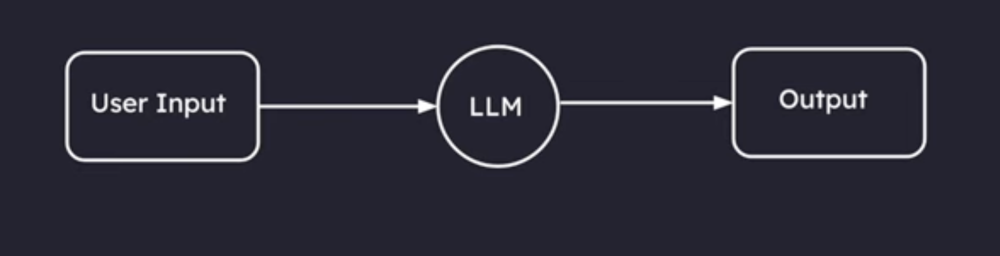
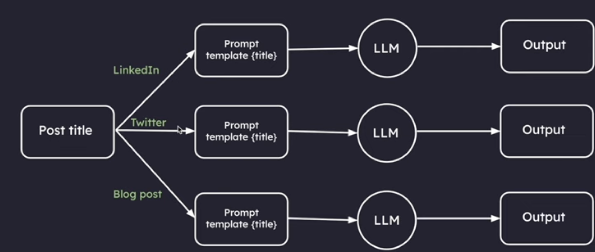
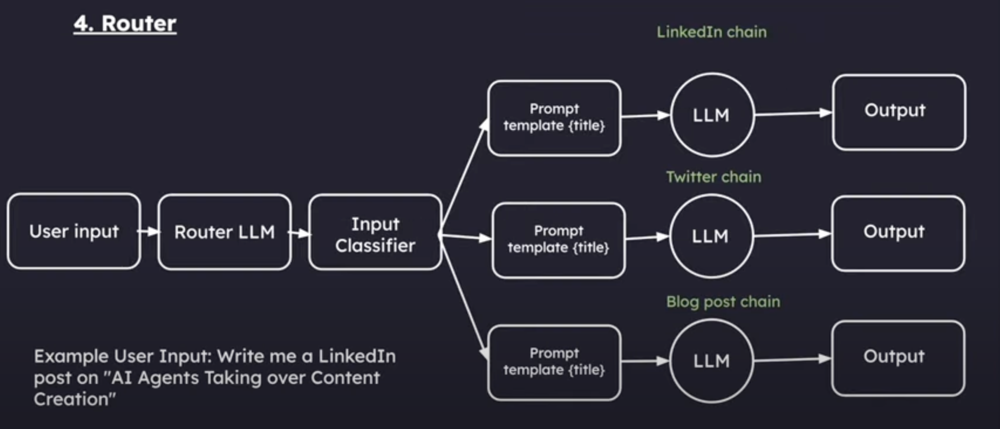
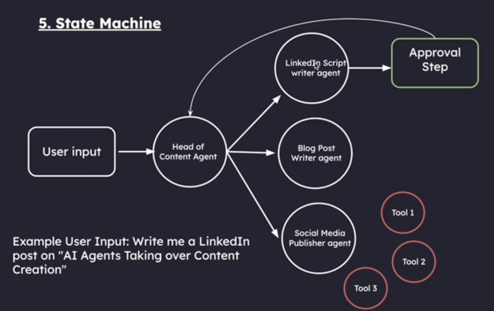
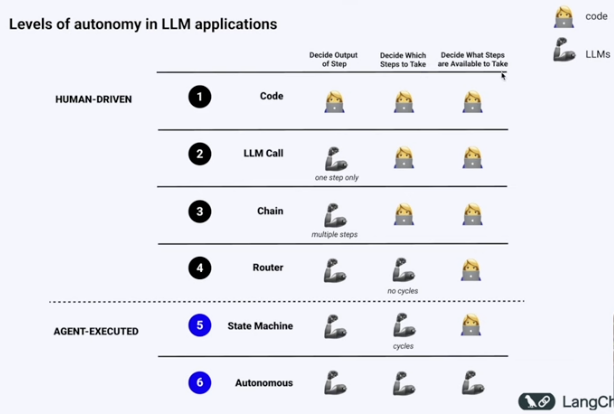

# Level of Autonomy in LLM Applications

## 1. Code
Code has zero autonomy and is 100% deterministic. Everything is hard-coded, and it does not function as a cognitive architecture.

**Disadvantage:**
The main problem is that you need to write rules for every possible scenario, making it impossible to handle real-world complexity.

---

## 2. LLM Call
A single LLM call means your app performs one primary function: you provide input, it processes it, and returns an output. 

**Examples:**
- Chatbots that take messages and respond.
- Translation apps.

This marked a significant improvement over hard-coded rules, but it remains at the second stage of autonomy.

**Disadvantage:**
Trying to get everything done in a single request often leads to confused or mixed-up responses—similar to how a single person cannot be an expert at everything.

---

## 3. Chains
Chains function like having multiple specialists instead of one generalist. Instead of asking one AI to handle everything, tasks are broken down into steps where each AI excels at a specific function.

**Example:**
- A customer service chatbot:
  1. The first AI reads the complaint and identifies the product.
  2. The second AI finds the correct solution from help documents.
  3. The third AI converts the solution into a friendly response.

Each step is simple, but together they create a much smarter system than a single LLM call.

**Disadvantage:**
Fixed sequences act like a rigid assembly line, always following predefined steps.

**Example User Input:** "AI Agents taking over Content Creation"

---

## 4. Router
Routers act like intelligent traffic controllers for AI. Instead of following a fixed sequence like chains, the AI dynamically decides which steps to take next.

**Example:**
- A personal assistant bot:
  - Determines whether the user needs help with scheduling, research, or calculations.
  - Routes the request to the appropriate tool or chain.

---

## 5. State Machine (Agent)
This level builds on the router but introduces loops, enabling dynamic control flow controlled by an LLM.

### Features:
1. **Human-in-the-loop:** The AI can request approval before proceeding.
2. **Multi-agent systems:** Different AI agents collaborate.
3. **Advanced memory management:** AI can track long-term interactions.
4. **Historical navigation:** Ability to go back and explore alternative paths.
5. **Adaptive learning:** AI learns and adapts over time.

At this stage, we start leveraging **LangGraph** for enhanced AI workflows.

---

### Chain/Router vs. Agent
- **Chain/Router:** One-directional processes—these are not considered agents.
- **State Machine (Agent):** Introduces cycles and dynamic control flow, making it a true AI agent.