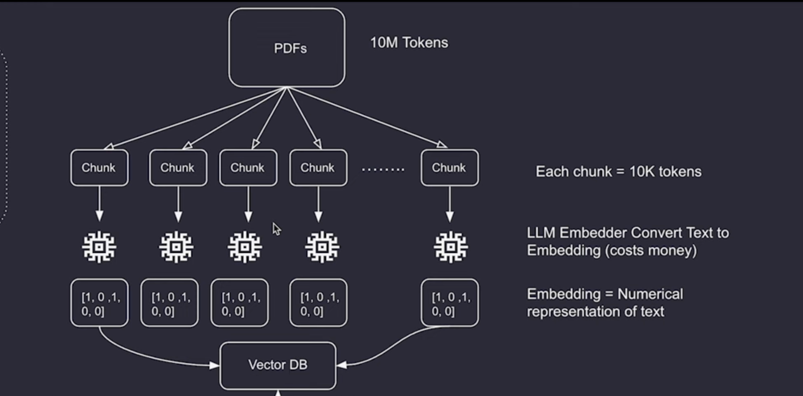
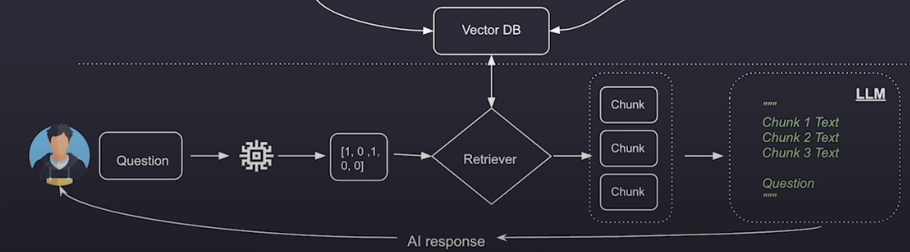
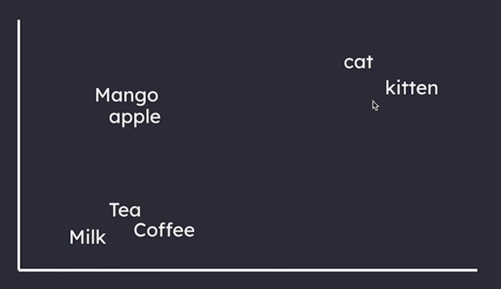

# LANGCHAIN

Langchain core components
1. Chat models
2. Prompt templates
3. Chains
4. RAGs
5. Agents and tools

For using langchain, first we create a virtual environment.

```python
python3 -m venv .venv
```

## Chat Models
Chat models is a component designed to communicate in a structured way with LLMs like GPT-4, Hugging Face and Claude Sonnet.

Why use langchain chat models? 

1. Consistent Workflow
2. Easy switching between LLMs
3. Context management
4. Efficient chaining
5. Scalability

```
pip3 install -qU langchain-openai
```

this will install langchain for openAI.

## Types of Messages in Langchain

1. System Message: Defines the AI's role and sets the context for the conversation. Eg: 'Youa re a marketing agent.'
2. Human Message: Represents user input or questions directe towards AI.
3. AI Message: Contains the AI response based on previous messages.

We don't want to store messages locally, we can get a db and satore messages there like firebase.
(Storing mesages to the cloud.)

# Prompt Templates

A PromptTemplate in LangChain is a structured way to format prompts dynamically. It allows you to define a prompt with placeholders and then fill in those placeholders with actual values at runtime. This helps in creating reusable and consistent prompts for LLM interactions.

There is one limitation with this, whenever we create a prompt template and give it values, it is always a list with one humanMessage. What if we want more control? like customising the SystemMessage too.
For that we can have a list of tuples.(refer to code)

# Chains

Chains are sequences of modular components (like LLMs, prompt templates, memory, and tools) that work together to process and generate responses. Instead of handling each step separately, Chains automate the flow of data through these components.

## Types of Chaining

1. ParallelChain – Lets tasks run independently without being dependent on each other.
2. SequentialChain – Chains multiple steps together in sequence.
3. RouterChain / ConditionalChaining – Routes inputs to different sub-chains based on conditions.
4. AgentChain – Uses AI agents to decide which tools or actions to use.


# RAGs

Retrieval Augmented Generation
The main problem RAGs solve is giving the LLm additional knowledge.
RAGs are used to provide LLMs an exzternal sourceof information so that it can better reply to our prompts.
Like a company has 100s of internal documents. If we are making AI, we can give those documents and ask the LLM then.

Context Window Limitation Challenge: 
If we give large context, LLM struggles to answer. 
It solves this by only pulling the relevant sections of the documents based on the prompt the user provided.

This retrieval system can search through vast sources of external information-like documents, databases, or knowledge bases-whenever the LLM needs additional knowledge to give you a better answers.
RAGs do all this while making sure LLMs are not overwhelmed with bigger prompts. 




## Tokens

In the context of language models, a token is a unit of text that the model processes.
Tokens can be as short as one character or as long as one word, depending on the language and structure of the text.

In a RAG system, the data goes througha process called chunking. Chunking is a process where we split a large document into smaller chunks.
Retriever can only query the relevant chunks then.

After taking a huge input and chunking it, pur next goal is to extract the relevant chunks only and then send them to the model.

Here the concept of embeddings and vector DBs comes.

## Embeddings and Vector DBs

A vector embedding is a mathematical representation of words, sentences or even images. For example, the word "cat" can have a vector embedding that can look something like this: [34, 21, 7.5, -12, 0.2, 18, -3]
So this is the computer's way of making sense of the word "cat"
Basically each of these numbers can represent a certain aspect of the word "cat".

Each of the values are actual coordinates in a multi diomesional space with things are related to each other being closer to each other.



Databse storing these vector embeddings is called a vector DB.

## Flowchart Continued

Now after we have chunks, we use a LLM embedder that converts text to embeddings. Then we would store them in the vector DB.
Each chunk is going to have the plain text version and embeddded version too.


## User flow

When the user asks any question, his prompt is converted to an embedding as well. Then we will have a retriever, which will ask the vector store to give top5 chuinks with highest relevant chunks to the question. 
Then we send the question and reelevant information in plain text to LLM.


## Chunk overlap

Chunk Overlap defines how many characters (or tokens, depending on the splitter) should be included in both the end of one chain and the beginning of the next
By setting Chunk Overlap = 0, you are telling the splitter to ensure that there's no overlap between chunks
If you set chunk_overlap = 100, for example, the last 100 characters of one chunk will appear at the beginning of the next chunk. This helps preserve context across chunks.
Semantic Understanding
Especially when working with large texts (like books), chunking with overlap can help with better understanding across the chunks when querying or processing

## RAGs with meta-data

Let's say we've put a 100 different private docs or books in our vector store, and we ask a question.
In addition to getting the chunks, it'll be better if we also know where the chunk originated from right?, For ex, like it's this book, chapter 4, paragraph 3 or this document, this section, paragraph 7